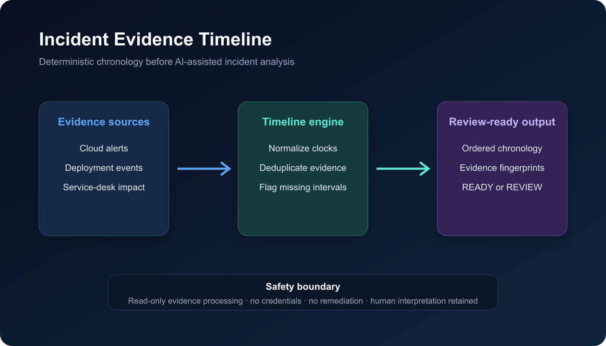

# Incident Evidence Timeline

Incident Evidence Timeline turns mixed cloud alerts, deployment records, and service-desk events into a deterministic chronology before an engineer—or an AI assistant—interprets an incident.



## The problem

Incident facts arrive from systems with different clocks, formats, identifiers, and failure modes. Feeding that raw stream directly into an AI summary can create a confident but incorrect sequence. Responders first need evidence that is normalized, deduplicated, ordered, and explicit about missing intervals.

## What it does

- corrects declared source clock offsets and normalizes timestamps to UTC;
- deduplicates identical source events and fails closed on conflicting identities;
- orders evidence deterministically with stable tie-breaking;
- flags gaps that exceed the configured threshold;
- preserves evidence fingerprints and an explainable `READY` or `REVIEW` decision;
- produces structured JSON suitable for an incident copilot, n8n workflow, or audit record.

The engine calls no API, stores no credentials, changes no infrastructure, and performs no remediation.

## Run locally

```bash
PYTHONPATH=src python -m unittest discover -s tests -v
PYTHONPATH=src python -m incident_evidence_timeline examples/incident-events.json
```

The sample contains a deliberate evidence gap, so the CLI returns `REVIEW` with exit code 1.

## Docker

```bash
docker build -t incident-evidence-timeline .
docker run --rm -v "$PWD/examples:/evidence:ro" \
  incident-evidence-timeline /evidence/incident-events.json
```

## n8n integration

`n8n/incident-evidence-workflow.json` is an inactive template. Review filesystem handling, authentication, payload limits, and command execution before enabling it in a controlled self-hosted environment.

## Safe deployment guidance

1. Export only the minimum event fields required from read-only sources.
2. Define clock offsets from measured source behavior, not guesses.
3. Keep raw evidence immutable and store the generated report separately.
4. Require human review when gaps or identity conflicts appear.
5. Pass the normalized report—not the raw stream—to any LLM summarizer.
6. Keep remediation in a separate, approval-gated system.

## Repository structure

```text
src/       deterministic engine and CLI
tests/     unit tests for ordering and failure paths
examples/  synthetic incident evidence
n8n/       inactive orchestration template
docs/      architecture visual
social/    publication and learning materials
```

## Interview positioning

This project demonstrates SRE incident reasoning, evidence normalization, deterministic automation, fail-closed validation, Python, CI/CD, Docker, n8n, auditability, and safe AI-orchestration boundaries.
